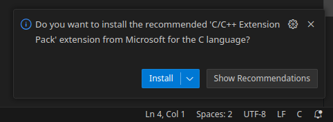
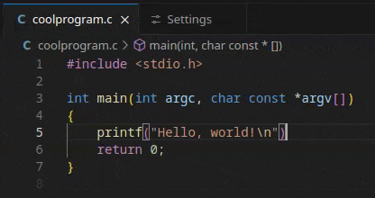
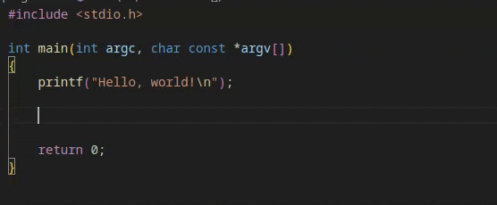
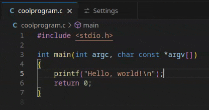
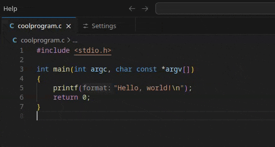
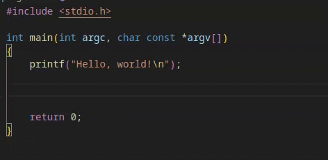
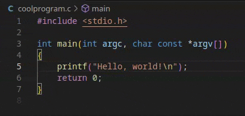
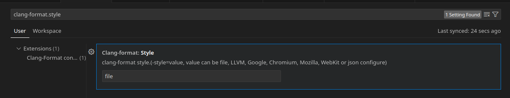
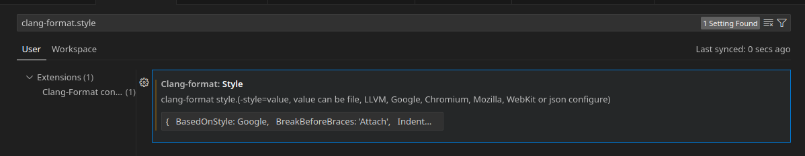

Visual Studio Code has been a pain to me for my entire coexistence with it. While I eventually moved to the greener
pastures of customization at Neovim, I have seen enough of the same fixes that I thought I ought to share how I made my
time writing in C/C++ less agonizing.

Most of these troubles come from the default that Visual Studio Code provides.

## The Defaults

The default experience for new users editing C/C++ code in Visual Studio Code is questionable. When you first open up a
C/C++ anywhere in the editor, Visual Studio Code sends you a notification telling you to get an extension called the
**C/C++ Extension Pack**.



Surely this is exactly what you need to have a fast and clean editing experience, right? Let's check!

This pack installs:

- [C/C++ Extension Pack](https://marketplace.visualstudio.com/items?itemName=ms-vscode.cpptools-extension-pack)
  - [C/C++](https://marketplace.visualstudio.com/items?itemName=ms-vscode.cpptools) (language server, slow)
  - [C/C++ Themes](https://marketplace.visualstudio.com/items?itemName=ms-vscode.cpptools-themes) (redundant color
    schemes)
  - [CMake](https://marketplace.visualstudio.com/items?itemName=twxs.cmake) (tools for CMake software, not used by all
    new developers)
  - [CMake Tools](https://marketplace.visualstudio.com/items?itemName=ms-vscode.cmake-tools) (see previous note)

Looking at these tools, we can note that you only really want _one_ of them&mdash;the **C/C++ Extension**. The other
extensions provide things that are most likely useless to the average developer trying out C. The themes are essentially
just the default dark theme with _very slightly_ altered code colors. The CMake related plugins are only useful if you
wish to specifically use CMake in your project.

The C/C++ Extension itself is a bit dodgy; the provided error highlighting takes relative ages to tell you once you've
messed up and leads to constantly stopping to wait for the extension to wake up and do its job.



In addition to this, the auto-completion it provides are lackluster. When you write in a valid function and try to
complete it, the extension just writes out the rest of the name&mdash;not completing the arguments.



In addition to these annoyingly mediocre features, it doesn't even make it clear that the C/C++ extension provides a
formatter or how to use it.

_(It's `ctrl+shift+i`, if you're wondering)_

The formatter works alright, though the method to customize it is
[buried in the documentation](https://code.visualstudio.com/docs/cpp/cpp-ide#_code-formatting).

## Improving the Setup

We can fix it through a few changes:

- Uninstall the **C/C++ Extension Pack**
- Get [clangd](https://marketplace.visualstudio.com/items?itemName=llvm-vs-code-extensions.vscode-clangd) (language
  server, fast)
  - Enable or disable inlay hints
- Get [C/C++ Snippets](https://marketplace.visualstudio.com/items?itemName=hars.CppSnippets) (auto-complete for things
  like `if` or `for` optional)
- Get [Clang-Format](https://marketplace.visualstudio.com/items?itemName=xaver.clang-format) (formatter, customizable)
  - Enable `Format On Save`
- Set the `clang-format.style` option to what you want

The first step is to just uninstall the **C/C++ Extension Pack**. This will uninstall all of the tools noted above in
one step. You won't need them after the next steps.

### Clangd

You can obtain the clangd extension via the extensions tab under `llvm-vs-code-extensions.vscode-clangd` or with the
following command in the Quick Open (`Ctrl+p`) menu:

```text
ext install llvm-vs-code-extensions.vscode-clangd
```

If you did not follow the step above to uninstall the **C/C++ Extension Pack**, you will receive a notification at the
bottom right telling you to disable IntelliSense the C/C++ Extension. Do that.

After the plugin is installed, you will note that the error highlighting works almost instantly now.



You may also note that functions have ghost text within them noting function parameter names. This is called Inlay Hints
and can be toggled through the Command Palette (`Ctrl+Shift+C`) command **clangd: Toggle inlay hints**.



These two options are generally all you need to know about the very basics of using clangd.

### C/C++ Snippets

You can obtain the C/C++ Snippets extension via the extensions tab under `hars.CppSnippets` or with the following
command in the Quick Open (`Ctrl+p`) menu:

```text
ext install hars.CppSnippets
```

Now if you type `printf` or other functions in a C file, you will get useful completions!



The ones provided by this plugin include more general and filled out versions of control flow statements like `forr`, or
`switch`.

### Clang-Format

You can obtain the Clang-Format extension via the extensions tab under `xaver.clang-format` or with the following
command in the Quick Open (`Ctrl+p`) menu:

```text
ext install xaver.clang-format
```

I was checking the reviews on this plugin while researching this and many mention that they existing `C/C++` extension
has the same functionality, but that requires its IntelliSense to be enabled which breaks things when combined with
Clangd.

After installing, you should now be able to format your code. By default, this can only be done manually with either the
Command Palette (`Ctrl+Shift+C`) command **Format Document** or through its keybind of `Ctrl+Shift+i`.



If you wish to automatically format your document whenever you manually save with `Ctrl+S`, you can enable it through
the setting `editor.formatOnSave` as changed in the settings menu accessed via `Ctrl+,`.

### Customizing Formatting

By default, Clang-Format will find a `.clang-format` file to use as its formatting style. If you have a specific way you
like to format all of your code more complex than the provided options of LLVM, Google, Chromium, Mozilla, or WebKit,
you can specify it manually via JSON.

To customize your formatting options, open up the settings menu and search for `clang-format.style`. The default is
`file` which you can replace with a JSON string of the options you want as specified the
[LLVM docs on Clang-Format](https://clang.llvm.org/docs/ClangFormatStyleOptions.html).



The following JSON strings _must_ be provided as the `style` parameter of a given language. Using them under
`Fallback Style` will not work and cause errors in the Output of your console.

Here is a basic JSON string setup:

```json
{
  BasedOnStyle: Google,
  BreakBeforeBraces: 'Attach',
  IndentWidth: 4,
  TabWidth: 4,
  ColumnLimit: 89,
  MaxEmptyLinesToKeep: 2,
  AlignTrailingComments: true,
}
```

The value of `BreakBeforeBraces` should be `'Attach'` for K&R style and `'Allman'` or unset for Allman style. The
default for Google is `'Attach'`, but if you wish to use another style it is important to have.

Here is what they look like:

```c
// K&R ('Attach')
while (x == y) {
    foo();
    bar();
}

// Allman ('Allman')
while (x == y)
{
    foo();
    bar();
}
```

Decide on your style, then copy the JSON into the `clang-format.style` setting. Whitespace is ignored, though make sure
that you have commas between every property and that single quotes are used throughout.

Here's the one from before on a single line:

<!-- markdownlint-disable MD013 -->

```json
{ BasedOnStyle: Google,  BreakBeforeBraces: 'Attach',  IndentWidth: 4,  TabWidth: 4,  ColumnLimit: 89,  MaxEmptyLinesToKeep: 2,  AlignTrailingComments: true,}
```

<!-- markdownlint-enable MD013 -->



For the full documentation see the [LLVM docs on Clang-Format](https://clang.llvm.org/docs/ClangFormatStyleOptions.html)
as mentioned before.

## Possible Issues

The clangd extension doesn't provide formatting of its own leading to the use of the Clang-Format plugin. This is an
issue as that plugin doesn't allow you to use a local file by default while still having your own formatting as a
fallback. The default C/C++ Extensions allows for this but has poor performance which I arbitrarily decided was worth
the trade-off.

I could also be missing some obvious method to make the default plugin faster, but at that point it's on the developers
for hiding a "make it work better" option when they provide the extension pack as the default.

## Conclusion

To be honest, I don't like C. If you have the chance, program in anything else; Rust, Zig, JavaScript(??), anything but
the horrors of C. If you must, I give you my greatest condolences and I hope prior advice can ease your pains if only by
a little.
