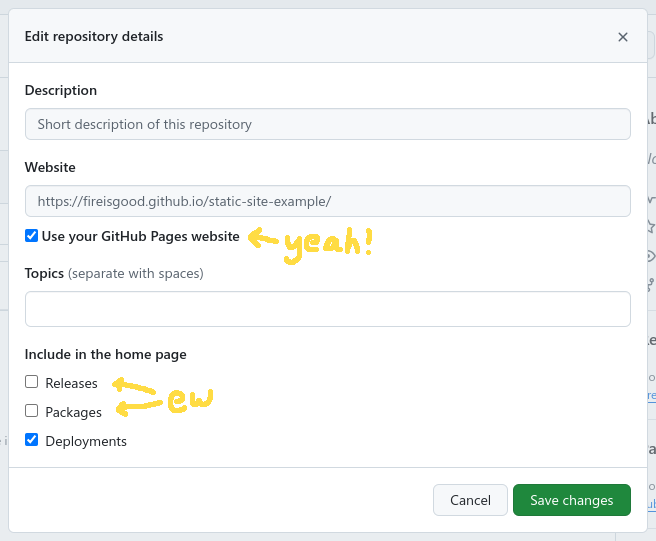

A static website is a website whose contents are basic HTML, CSS, and JS&mdash;hand-written or generated from more code.
These files can then be served over many services directly without having to run a special type of server&mdash;they
just need to be able to serve files. This makes them the easiest way to host websites as long as the content on the site
doesn't change constantly.

For learning web development, I believe making a site in this way is one of the fastest ways to get something you've
made out there.

To create a static website, you first need to make your website's files and then host them somewhere online.

## Making the Website

To start out, you don't really need a framework or otherwise&mdash;Just some basic HTML. We start out in our project's
directory with a file called `index.html` so it will be loaded to the base path of the URL.

```html title="index.html"
(empty file right now)
```

If you're using a modern code editor with completions from [Emmet](https://emmet.io) you can get the basic outline with
a code snippet expanded from `html:5`. You should also have a formatter on hand for this process to keep things tidy. I
use [Prettier](https://prettier.io) as it's widely used and doesn't need configuration to work well.

Below is the snippet provided by Emmet and cleaned up by Prettier:

```html title="index.html"
<!doctype html>
<html lang="en">
  <head>
    <meta charset="UTF-8" />
    <meta name="viewport" content="width=device-width, initial-scale=1.0" />
    <title>Document</title>
  </head>
  <body></body>
</html>
```

With this template, you can add some semantic HTML and some placeholder content. I usually add in Pico CSS just to get
things looking good to start, so I've added the classless basic version in the `<head>`.

<!-- use default prettier format as an example -->
<!-- prettier-ignore -->
```html title="index.html"
<!doctype html>
<html lang="en">
  <head>
    <meta charset="UTF-8" />
    <meta name="viewport" content="width=device-width, initial-scale=1.0" />
    <title>I'm the best</title>
    <link
      rel="stylesheet"
      href="https://cdn.jsdelivr.net/npm/@picocss/pico@2/css/pico.classless.min.css"
    />
  </head>
  <body>
    <main>
      <article>
        <h1>I'm the best</h1>
        <p>It's simply well known</p>
      </article>
    </main>
    <footer>
      <p>Made by me, the best</p>
    </footer>
  </body>
</html>
```

Now you're ready to host it online!

## Hosting it Online

Hosting a static website can be done through many sources for free or through paid services to get servers for you.
Unfortunately for our objective, these aren't very fast to set up and you're unlikely to have an account on some web
hosting service if you're making a website for the first time.

As we want to get this hosted fast, we can use something very fast or very widespread in the forms of Surge or GitHub
Pages. They both have a few trade-offs as listed here for brevity:

- [Surge](https://surge.sh)
  - Just need an email
  - All from the command line
  - Must manually republish
  - Default URL is `[custom-name-here].surge.sh`
- [GitHub Pages](https://pages.github.com)
  - Requires a GitHub account (you probably have one)
  - Additional step to configure the repository on GitHub
  - Automatically republishes on Git push
  - Default URL is `[your-github-username].github.io`; the base domain or a subdomain of it.
    - The repository `test/cool-website` will be hosted at `test.github.io/cool-website`
    - The repository `test/test.github.io` will be hosted at `test.github.io`

For the main section of this guide, we will use Surge to just get the site up fast. Afterwards, we will go back and host
over GitHub Pages for open source sites you want to redeploy as you commit updates.

### Hosting over Surge

To host over surge, you need to use the Surge CLI. Using [NPM](https://www.npmjs.com) you can either install it globally
or run it via `npx`.

```bash
# Install globally
npm install --global surge
# Run
surge

# Run directly
npx surge
```

With either of these methods, run the Surge CLI in your project's directory, then follow the prompts. You did it!
Whenever you want to update your website, just run your Surge command and use the same URL.

You can see an example website at [unadvised-chance.surge.sh](https://unadvised-chance.surge.sh) and its extremely
minimal code at my [GitHub repository](https://github.com/FireIsGood/surge-static-article).

For a more detailed guide, you can check out the [Surge Docs](https://surge.sh/help/getting-started-with-surge) on this
topic.

### Hosting over GitHub Pages

To host over GitHub Pages, you need a GitHub account and Git. To use GitHub pages without the 'Pro' subscription, your
repository will need to be public. Additionally, the default for using a repository that isn't named in the format of
`[your-github-username].github.io` will be deployed as a subdomain under that URL.

To start, initialize a Git repository in your project folder and commit everything.

```bash
git init
git add -a
git commit -m "Initial Commit"
```

Next, [create a new repository on GitHub](https://github.com/new). I would recommend to not add anything as it will show
you how to push your files if you don't have files in the repository.

If you added any options, you will have to manually type:

```bash
git remote add origin https://github.com/[your-username]/[repository-name].git
git branch -M main
git push -u origin main
```

Now, navigate to the GitHub repository online and go to the **Settings** tab and then **Code and automation -> Pages**.
Change the "Source" option to GitHub Actions and click "Configure" on the **Static HTML** option. Click **Commit
Changes**, rename the commit if you want, and click **Confirm**.


This adds a file at `.github/workflows/static.yml` which will redeploy your site whenever changes are pushed to main. If
you ever need to change anything about this, you can find it in that file. Your site should now be up within a few
seconds!

#### Final Touches

For some final touches, you can make the GitHub page link directly to your new site instead of having users find it
under Deployments. To do this, navigate to the top right gear icon to open the settings.


Then, check the **Use your GitHub Pages website**. While you're there, you can also uncheck the **Releases** and
**Packages** options to clean up the side bar.



After you save your changes, the link to your site should appear under the About header.


Whenever you want to update your website, just push local Git changes to your main branch. As with the initial
deployment, changes should appear live on the site within seconds!

You can see my example at [fireisgood.github.io/static-site-example](https://fireisgood.github.io/static-site-example/)
and its moderately minimal code at my [GitHub repository](https://github.com/FireIsGood/static-site-example).

For a more detailed guide, you can check out the [GitHub Pages Docs](https://docs.github.com/en/pages/quickstart) on
this topic.

## Conclusion

It's really that simple.

If you want to continue refining your site by adding a custom domain or a better site in general, find some other
article, I'm not going to explain it here.

### Further Research

There are other hosts such as Netlify, Vercel, or Digital Ocean with nice free tiers for static hosting. For more
information on those, you can check out [Free For Dev page on Web Hosting](https://free-for.dev/#/?id=web-hosting).

You could also run your static site on a Virtual Private Server service or host it yourself if you wanted more control
on the backend. Services like [Hostinger](https://www.hostinger.com/vps-hosting),
[Digital Ocean](https://www.digitalocean.com/pricing), and many others can be found for this purpose.
