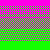

Top level text.

And another one.



Text below that placeholder

## Header 2

Text beneath that.

### Header 3

Text beneath that.

#### Header 4

Text beneath that.

## Style tests

And here's some **bold** text. Maybe also some _italic_ text and as a treat some **_bold and italic_** text.

Perhaps I might even enjoy some `inline code` or a [link to somewhere](/).

Here's some emoji: 🔥💥 | 🌊⛱️🐴

And some random JS entities: &times; &dagger; &copy; &para;

Here's what a HR element looks like:

---

More text

Maybe a list or two:

- first
- second
- third

And an ordered list?

1. first
2. second
3. third

Yeah.

## Some code blocks

And here are some `code` blocks using the expressive code features:

```text title="Cool text file.txt"
wow this is
    in a text box
```

As you can see in the diagram below:

```bash title="roulette.sh" frame="terminal" {1, 5, 9-10}
#!/usr/bin/env bash
# Roll for death
RES=$(shuf -i 1-6 -n 1)
echo "Rolled '$RES'"
if [ "$RES" != "6" ]; then
  echo "You were spared"
  exit 0
fi
USERS=($(who | awk '{print $1}'))
RANDOM_USER="${USERS[$RANDOM % ${#USERS[@]}]}"
echo "Your huberis has caused this. $RANDOM_USER will now be sent The Message"
echo "Good girl" | write "$RANDOM_USER"
```

```html title="Why are you running HTML in the terminal?" frame="terminal"
<p>My name&mdash;is mine!</p>
<a href="coolbugfacts.com">Cool bug facts</a>
```

JavaScript or something...

```ts
const heck;
let heck;
console.log("We are gaming"); // prints some text wow

420 > 520;

() => {
  let me = "you";
};

// What
function hi(arg1: color, arg2) {
  return arg1 - arg2;
  return /hi/;
}

class epic {
  constructor() {
    this.epic = true;
  }
}

type enum = "hi" | "wow" | number
```

```css title="css-finaldraft_FINAL_FINAL2(2) Copy.css"
#id .class element {
  property: value;
  property: "string" !important;
}
```

### Difference block

Wow

```diff title="replacement.txt"
- your mom
+ my mom
```

With expressive code, you can also mark up regular code blocks:

```js del={"1":1} add={"1":2} del={"2":3} add={"2":4} {"Log this like lumber":9} {"3":10}
let b = [];
let b = [0];
let a = (() => {
let a = (function () {
  return this;
}
  .bind(b)()
  .map((_) => _)[0] = 2);

console.log(a, b);
```

We preform the following changes in the code block above:

1. Add an example element to override
2. Make `this` work

Noted in mark 3, when we output this it will write `0 [2]`

### And also regex

Because why not?

There's both plain text

```text "sus"
iybakljsnrposusuibzjsdhruiowuerpioasdnfaklehior
asjdhfbluyewporbhiospoihjpiosrusjklhrlsuiaophzs
hviumqwlekjiopuosussdfopigusoeritiuzysprhphaslk
paosdubrqnbiquypzsjndfkjhbflkjeytohwiupbiususfg
```

And regex:

```text /f\w*[nc]/
Why not just use all three type of functions? Because I said so.

function()
func()
fn()
```

Oh and capture groups

```text /hel(l)o/
Have you ever noticed the second occurrence of the letter 'l'? I have.
Here you may see it in words like "hell" but that's not enough. I simply
must see something like "hello". See it now? The beauty of the second one.
```

You can also make this type of text as your selection instead of line numbers:

```text add="fish" del="ocean" /[w|W]ater/
I often dream of fish. To be one with the sea.

The calm waves of the ocean and the plentiful water.

It is truly a beautiful sight, oft to be shared with all others.

Water seeps into your sheets as you drift off.
```
